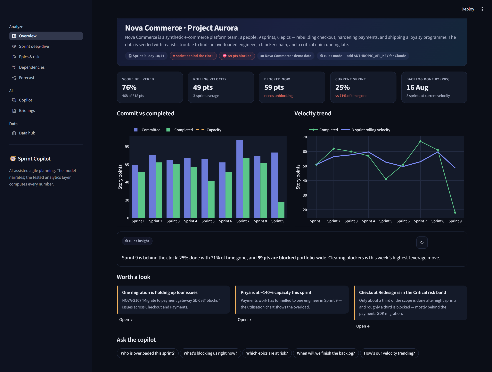
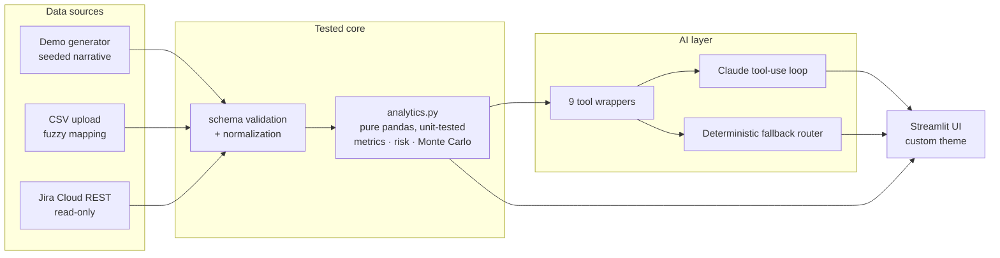

# 🧭 Sprint Copilot — AI-assisted agile planning

**Ask your sprint data anything.** A Streamlit dashboard where an AI copilot answers planning questions — *who's overloaded, what's blocking us, when will we ship* — by calling a tested, pure-pandas analytics layer. The model writes the narrative; **it never computes a number itself**, so answers can't hallucinate metrics.

> **Stack:** Python · Streamlit · Pandas · Plotly · NetworkX · Anthropic Claude (tool use) · Monte Carlo forecasting

## What makes it interesting

1. **Grounded AI, not vibes.** The copilot uses Claude's tool-use API over nine typed tools (`get_delivery_risk`, `get_capacity_vs_load`, `get_forecast`, …) that wrap unit-tested pandas functions. The tool calls stream live in the chat while it works, and the answer's numbers match the charts exactly.
2. **Works without an API key.** A deterministic keyword router answers the same questions using the *same* tools — the demo never breaks, and every answer is labelled with its source (✦ Claude or ⚙ rules).
3. **The demo data tells a story.** Nova Commerce: 8 people, 9 sprints, 6 epics — with seeded, test-pinned anomalies to discover: an engineer at 160% utilisation, one migration blocking four issues, a Critical-risk epic, a mid-quarter velocity dip.
4. **Real forecasting.** Monte Carlo simulation over the team's own velocity history produces p50/p70/p85/p95 finish dates, with what-if controls for scope and team size.
5. **Bring your own data.** Drag-and-drop a Jira/Linear CSV export (fuzzy column mapping + status normalization), or connect read-only to a live Jira Cloud board with an API token. Nothing leaves your machine.

## Ask the copilot

Example — click a suggested pill or type your own:

> **You:** Who is overloaded this sprint?
>
> `→ get_capacity_vs_load()`
>
> **Copilot:** Capacity in S09 (assigned vs capacity):
> - Priya Sharma: **16 pts** of 10 (160%) ⚠️ overloaded
> - Devon Park: **10 pts** of 8 (125%) ⚠️ overloaded
> - Tom Nguyen: **8 pts** of 7 (114%) ⚠️ overloaded
> - Aisha Khan: **10 pts** of 10 (100%) …
>
> **Takeaway:** rebalance work away from Priya Sharma first.

Other things it answers from tools: *"What's blocking us right now?"* (blocker hotspots + blast radius), *"Which epics are at risk?"* (explainable 0–100 risk scores with named drivers), *"When will we finish the backlog if we add an engineer?"* (Monte Carlo with a capacity delta), *"How's our velocity trending?"*.

## Feature tour

| Page | What it shows |
|---|---|
| **Overview** | Hero KPIs, commit-vs-completed and velocity charts, an AI insight card, and "worth a look" callouts that deep-link to each seeded anomaly |
| **Copilot** | Full chat grounded in the analytics layer, with live tool-call tracing |
| **Sprint deep-dive** | Per-sprint burn-down (ideal vs actual), per-person utilisation with overload warnings, full issue table |
| **Epics & risk** | Explainable delivery-risk score per epic with named drivers (blocked %, progress gap, scope, priority, external deps) |
| **Dependencies** | Interactive blocker graph — node size = blast radius — plus hotspot ranking |
| **Forecast** | Monte Carlo completion distribution + what-if sliders (±scope, ±1 engineer) |
| **Briefings** | Streamed, audience-specific write-ups: sprint review, backlog refinement, leadership |
| **Data hub** | Demo / CSV upload wizard / Jira Cloud connector / CSV exports for Tableau or Power BI |

## How the AI is grounded

Each question enters a manual tool-use loop: Claude requests tools, the app executes them against the active dataset, and results go back as `tool_result` blocks until the model produces text (capped at 6 iterations). The system prompt carries a compact data dictionary for entity resolution but *zero metric values*, and instructs the model to never state a number it didn't get from a tool. With no `ANTHROPIC_API_KEY` — or on any API failure — the keyword router answers from the same tool functions.

The whole pipeline is covered by 48 tests: the analytics math, the forecaster, the CSV/Jira normalizers, the copilot tool layer (including loop termination against a mocked client), the seeded demo anomalies, and a headless render of every page.

## License

MIT — see [LICENSE](LICENSE).
